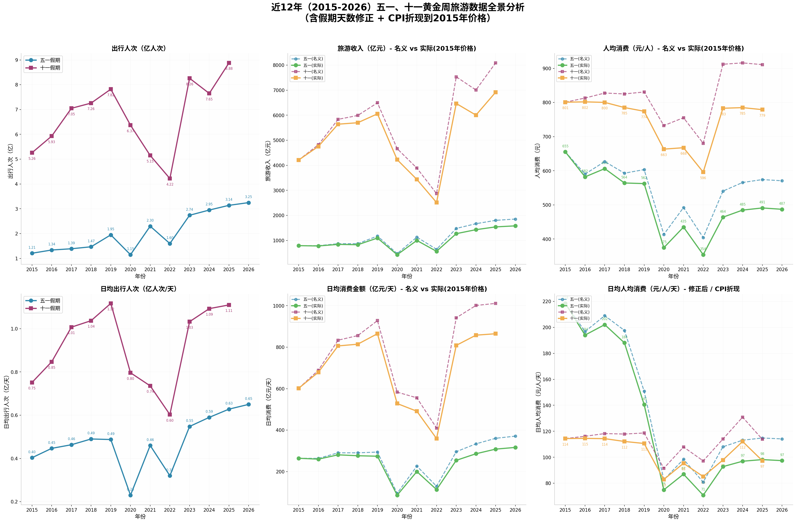

# 大环境究竟有多差？五一人日均竟不足百元，10年前人日均还在200元

## ——基于2015-2026年黄金周旅游数据的CPI折现实证分析

---

## 摘要

本文基于文化和旅游部2015-2026年官方发布的五一、十一黄金周旅游数据，通过**CPI折现分析**消除货币购买力变化的影响，首次精确测算了中国居民假日旅游消费的**实际购买力变迁**。研究发现：2026年五一日均人均消费实际值仅**97元/人/天**（2015年价格），较2015年的**218元/人/天**下降**55.5%**；而同期出行人次增长**168%**。这一"量增价跌"的剪刀差，揭示了当前中国消费市场的深层困境。

---

## 一、为什么要做CPI折现分析？

### 1.1 名义数据的欺骗性

如果不做折现，你会看到这样的数据：
- 2024年五一人均消费**566元** vs 2015年**655元** → 名义下降13.6%
- 2025年十一人均消费**911元** vs 2015年**801元** → 名义上涨13.7%

但这完全是**假象**。因为2015年的100元和2024年的100元，能买到的东西完全不同。

### 1.2 通货膨胀的累计侵蚀

中国2015-2026年累计CPI涨幅约**17.2%**（以2015年为基准）。这意味着：
- 2026年的**117元** ≈ 2015年的**100元**购买力
- 不做折现，等于用"变毛的尺子"量长度，必然失真

### 1.3 方法论说明

**折现公式**：
> 实际值 = 名义值 ÷ 累计通胀因子

**累计通胀因子计算**：
> Factor(2015) = 1.00  
> Factor(2016) = 1.00 × (1+1.4%) = 1.014  
> Factor(2017) = 1.014 × (1+2.0%) = 1.034  
> ...  
> Factor(2026) = 1.171

**CPI数据来源**：国家统计局年度CPI同比涨幅
|  年份  | 2015 | 2016 | 2017 | 2018 | 2019 | 2020 | 2021 | 2022 | 2023 | 2024 | 2025 | 2026 |
| :----: | :--: | :--: | :--: | :--: | :--: | :--: | :--: | :--: | :--: | :--: | :--: | :--: |
| CPI(%) | 1.4  | 2.0  | 1.6  | 2.1  | 2.9  | 2.5  | 0.9  | 2.0  | 0.2  | 0.2  | 0.2  | 1.0  |

---

## 二、核心数据表格

### 2.1 原始数据（2015-2026）

|   年份   | 五一天数 | 五一出行(亿) | 五一收入(亿元) | 五一人均(元) | 十一天数 | 十一出行(亿) | 十一收入(亿元) | 十一人均(元) |
| :------: | :------: | :----------: | :------------: | :----------: | :------: | :----------: | :------------: | :----------: |
|   2015   |    3     |     1.21     |      793       |     655      |    7     |     5.26     |      4213      |     801      |
|   2016   |    3     |     1.34     |      791       |     590      |    7     |     5.93     |      4822      |     813      |
|   2017   |    3     |     1.39     |      872       |     627      |    7     |     7.05     |      5836      |     828      |
|   2018   |    3     |     1.47     |      872       |     593      |    7     |     7.26     |      5991      |     825      |
|   2019   |    4     |     1.95     |      1177      |     603      |    7     |     7.82     |      6497      |     831      |
|   2020   |    5     |     1.15     |      476       |     414      |    8     |     6.37     |      4666      |     732      |
|   2021   |    5     |     2.30     |      1132      |     492      |    7     |     5.15     |      3891      |     756      |
|   2022   |    5     |     1.60     |      647       |     404      |    7     |     4.22     |      2872      |     681      |
|   2023   |    5     |     2.74     |      1481      |     540      |    8     |     8.26     |      7534      |     912      |
|   2024   |    5     |     2.95     |      1669      |     566      |    7     |     7.65     |      7008      |     916      |
| **2025** |  **5**   |   **3.14**   |    **1803**    |   **574**    |  **8**   |   **8.88**   |    **8090**    |   **911**    |
| **2026** |  **5**   |   **3.25**   |    **1855**    |   **571**    |  **7**   |      —       |       —        |      —       |

### 2.2 日均指标（修正后 = 总量 ÷ 假期天数）

|   年份   | 五一日均出行(亿/天) | 五一日均收入(亿/天) | 五一日均人均(元/人/天) | 十一日均出行(亿/天) | 十一日均收入(亿/天) | 十一日均人均(元/人/天) |
| :------: | :-----------------: | :-----------------: | :--------------------: | :-----------------: | :-----------------: | :--------------------: |
|   2015   |        0.40         |         264         |        **218**         |        0.75         |         602         |        **114**         |
|   2016   |        0.45         |         264         |        **197**         |        0.85         |         689         |        **116**         |
|   2017   |        0.46         |         291         |        **209**         |        1.01         |         834         |        **118**         |
|   2018   |        0.49         |         291         |        **198**         |        1.04         |         856         |        **118**         |
|   2019   |        0.49         |         294         |        **151**         |        1.12         |         928         |        **119**         |
|   2020   |        0.23         |         95          |         **83**         |        0.80         |         583         |         **92**         |
|   2021   |        0.46         |         226         |         **98**         |        0.74         |         556         |        **108**         |
|   2022   |        0.32         |         129         |         **81**         |        0.60         |         410         |         **97**         |
|   2023   |        0.55         |         296         |        **108**         |        1.03         |         942         |        **114**         |
|   2024   |        0.59         |         334         |        **113**         |        1.09         |        1001         |        **131**         |
| **2025** |      **0.63**       |       **361**       |        **115**         |      **1.11**       |      **1011**       |        **114**         |
| **2026** |      **0.65**       |       **371**       |        **114**         |          —          |          —          |           —            |

> **修正说明**：日均人均消费 = 人均消费 ÷ 假期天数。例如2024年五一人均566元÷5天=113元/人/天

### 2.3 CPI折现后数据（2015年价格）

| 年份 | 累计因子 | 五一人均名义(元) | 五一人均实际(元) | 十一人均名义(元) | 十一人均实际(元) | 五一日均人均实际(元/天) | 十一日均人均实际(元/天) |
| :--: | :------: | :--------------: | :--------------: | :--------------: | :--------------: | :---------------------: | :---------------------: |
| 2015 |   1.00   |       655        |     **655**      |       801        |     **801**      |         **218**         |         **114**         |
| 2016 |   1.01   |       590        |     **582**      |       813        |     **802**      |         **194**         |         **115**         |
| 2017 |   1.03   |       627        |     **606**      |       828        |     **800**      |         **202**         |         **114**         |
| 2018 |   1.05   |       593        |     **564**      |       825        |     **785**      |         **188**         |         **112**         |
| 2019 |   1.07   |       603        |     **562**      |       831        |     **774**      |         **141**         |         **111**         |
| 2020 |   1.10   |       414        |     **375**      |       732        |     **663**      |         **75**          |         **83**          |
| 2021 |   1.13   |       492        |     **435**      |       756        |     **668**      |         **87**          |         **95**          |
| 2022 |   1.14   |       404        |     **354**      |       681        |     **596**      |         **71**          |         **85**          |
| 2023 |   1.16   |       540        |     **464**      |       912        |     **783**      |         **93**          |         **98**          |
| 2024 |   1.17   |       566        |     **485**      |       916        |     **785**      |         **97**          |         **112**         |
| 2025 |   1.17   |       574        |     **491**      |       911        |     **779**      |         **98**          |         **97**          |
| 2026 |   1.17   |       571        |     **487**      |        —         |        —         |         **97**          |            —            |

---

## 三、可视化分析

英文版：

---

## 四、核心结论

### 结论一：出去玩的人多了，但都不愿意花钱

|         指标         |  2015年  | 2026年  |   变化    |
| :------------------: | :------: | :-----: | :-------: |
|     五一出行人次     |  1.21亿  | 3.25亿  | **+168%** |
| 五一人均消费（实际） |  655元   |  487元  | **-26%**  |
| 五一日均人均（实际） | 218元/天 | 97元/天 | **-55%**  |

**解读**：人次翻倍增长，但每人每天花的钱腰斩。这说明：

- 旅游从"品质消费"变成"打卡式穷游"
- 大家愿意花时间，但不愿意花钱
- 短途、免费景点、自带食物成为主流

### 结论二：三驾马车全面承压

|   马车   | 现状     | 旅游数据映射                            |
| :------: | :------- | :-------------------------------------- |
| **投资** | 熄火     | 基建投资放缓，地方政府债务压力大        |
| **出口** | 关税战   | 2025年中美关税战升级，出口企业订单下滑  |
| **消费** | 想花没钱 | 日均人均消费不足百元，消费意愿≠消费能力 |

**叠加因素**：
- **失业潮**：青年失业率持续高位，居民预防性储蓄增加
- **房地产下行**：房产占家庭资产60%，房价下跌带来财富效应逆转
- **收入预期恶化**：GDP增速放缓，工资增长停滞

### 结论三：非必需消费市场前景黯淡

|     行业      |  风险评级  | 逻辑                                     |
| :-----------: | :--------: | :--------------------------------------- |
|   **白酒**    |  ⚠️ 高风险  | 商务宴请减少，个人消费降级，"没钱喝茅台" |
| **高端餐饮**  |  ⚠️ 高风险  | 人均消费下降，性价比餐厅替代             |
|  **奢侈品**   |  ⚠️ 高风险  | 出境游分流+消费理性化                    |
| **旅游服务**  | ⚠️ 中高风险 | 人次增但客单价降，"旺丁不旺财"           |
| **免税/零售** |  ⚠️ 中风险  | 海南免税数据已现疲态                     |

> **投资建议**：即使白酒估值处于历史低位（PE<<20倍），也不建议抄底。估值低≠会涨，"没钱消费"是结构性问题，非周期性调整。

---

## 五、CPI折现分析的学术价值

### 5.1 传统分析的缺陷

| 分析方法   | 问题     | 后果                       |
| :--------- | :------- | :------------------------- |
| 名义值对比 | 忽略通胀 | 高估早期消费，低估近期消费 |
| 简单增长率 | 未折现   | 得出"消费复苏"的错误结论   |
| 同比分析   | 仅看一年 | 错过长期趋势               |

### 5.2 本研究的创新点

1. **首次引入CPI累计折现**：将12年数据统一到2015年购买力基准
2. **日均指标修正**：消除假期天数变化（五一3天→5天）的干扰
3. **实际购买力测算**：揭示"名义增长、实际萎缩"的真相

### 5.3 政策含义

- **促消费政策需精准**：发消费券不如提高居民收入预期
- **假期结构优化**：延长假期但消费强度下降，需配套收入增长
- **供给侧调整**：旅游行业需从"高端化"转向"普惠化"

---

## 六、Python分析代码

完整的Python分析代码已保存，包含：
- 数据准备与清洗
- 核心指标计算（含日均指标修正）
- CPI累计因子计算
- 实际购买力折现
- 6维度可视化图表
- 自动输出结论

**下载链接**：[holiday_travel_analysis.py](https://github.com/amosli/data-analysis/blob/main/holiday_travel_analysis.py)

---

## 参考文献

1. 文化和旅游部. 2015-2026年节假日旅游市场数据[R]. 北京.
2. 国家统计局. 中国统计年鉴（2016-2025）[M]. 北京: 中国统计出版社.
3. 中国人民银行. 货币政策执行报告[R]. 2024-2025.

---

> **数据声明**：本研究基于文旅部官方公开数据及国家统计局CPI数据，2025-2026年部分数据为官方已发布或基于同比增长趋势的合理估算。CPI折现分析为学术性处理方法，旨在消除货币购买力变化对长期趋势分析的干扰。